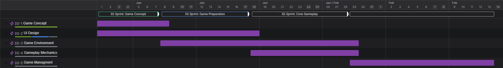

# Overview
A non-profit fun-made project focused on developing a cross-platform hidden-identy game using .NET MAUI. We want to navigate the full lifecycle of product development: from initial requirements and UI/UX design to final implementation. Our goal is to challenge and improve our project management, team cooperation and software engineering skills.

# Table of Contents
- [Game Concept](#game-concept)
- [UI/UX Design](#uiux-design)
- [Roadmap](#roadmap)
- [~~Technology Stack~~ (not implemented yet)](#technology-stack)
- [~~Architecture~~ (not implemented yet)](#architecture)
- [~~Final Product~~ (not implemented yet)](#final-product)
- [~~Setup~~ (not implemented yet)](#setup)

# Game Concept

The game is a social deduction experience based on hidden identity mechanics. Players are divided into secret factions and assigned specific roles with access to privileged information.

The narrative follows the Convoy of the Numbian Princess as it treks across a treacherous desert to forge a vital political alliance. 
While the Princess seeks to unite two nations through a political marriage, the Nomads view this alliance as a death sentence for their ancestral lands.

The core game loop follows a state-driven, turn-based structure. Each round centers on the survival of the convoy as it moves from one desert well to the next, requiring careful selection of "Emissaries" to manage negotiations with the locals.

Expansion: [game-concept.md](docs/game-concept.md)

# UI/UX Design

The design process was created based on a user-centered design (UCD) approach, focusing on understanding the players' needs and preferences.

At the beginning, we conducted user research through surveys and interviews to gather insights into players' expectations and pain points in similar games (read more: [user-research.md](docs/user-research.md)).
Based on the research findings, we developed user personas to represent our target audience and guide the design decisions.
Then, we had defined the user flows and screen map to ensure a seamless and intuitive navigation experience.
It was followed by creating wireframes, design system, mocups and a functional prototypes to visualize the layout and interactions of the game interface. 
These prototypes were tested with users to gather feedback and make improvements.

Expansion: [design.md](docs/design/design.md)

# Roadmap

The project is currently in the design phase, with the following milestones planned:
1. UX Design and Game Concept (Completed)
2. UI Design and Game Preparation (In Progress)
3. Development of Core Game Mechanics - Minimum Viable Product (Upcoming)
4. Adding Advanced Features (Upcoming)
5. Testing and Quality Assurance (Upcoming)
6. Launch and Post-Launch Support (Upcoming)

