# Design Documentation

This document outlines the design process and decisions made for the game project.

---

# User Experience (UX) Design

## Information Architecture

Users: Players and Game hosts

Context: Multiplatform app for an online version of a card game with hidden identities 

Content: Game enviroment, Game state, Game rules, Game mechanics 

Knowledge that the user may need at every stage of the game was grouped into categories based on their importance at the game phase, what is shown on the image below.

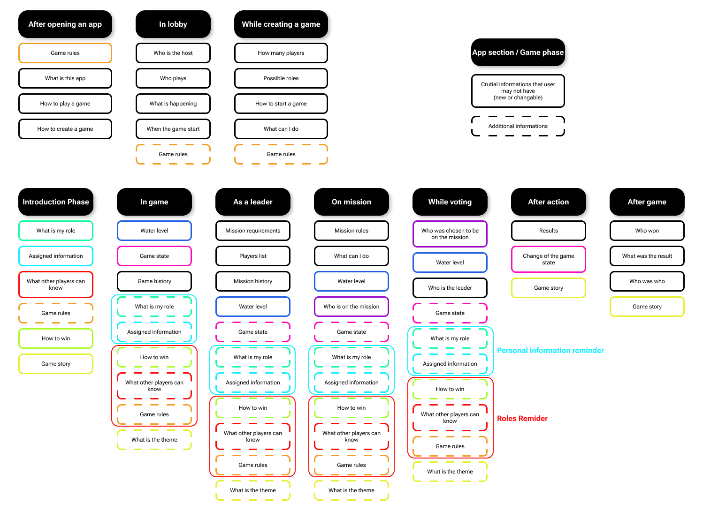

We identified interconnected groups of information:
- Personal Information Reminder: Details about the player's assigned role, abilities, informations and fraction.
- Gameplay Mechanics + Roles Reminder: Information about game rules, phases, and actions available to other players.
- The Game Theme: Will be kept by the user interface style.

Based on the information architecture we recognised following screens:
- Welcome Page
- Game Lobby screen
- Game Creation screen
- Game Managment screen
- Introduction screen
- Personal Information screen
- Game screen
- Personal Information Reminder (modal)
- Roles Reminder (modal)
- Notification History (modal)
- Team Choosing screen
- Voting screen
- Mission Resolution screen
- Game Summary screen

## User Flows

Logic and decision paths users take to complete tasks within the app.

| Image                                                         | User Flow Name       | Description |
|---------------------------------------------------------------|----------------------|-------------|
| 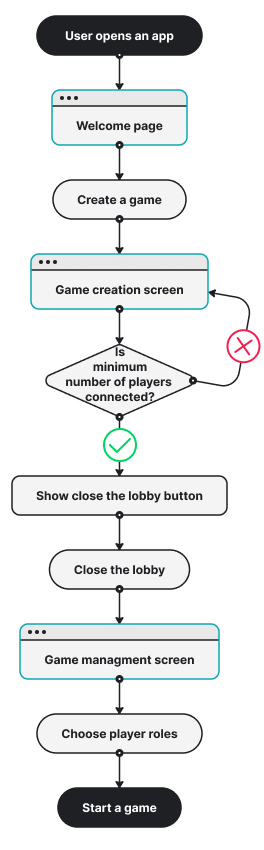        | Start a Game         | Initial setup flow where the host creates a new game, configures settings, and launches the session. |
|           | Join a new Game      | Flow allowing a player to join an existing game session by entering a game code or selecting an available lobby. |
| 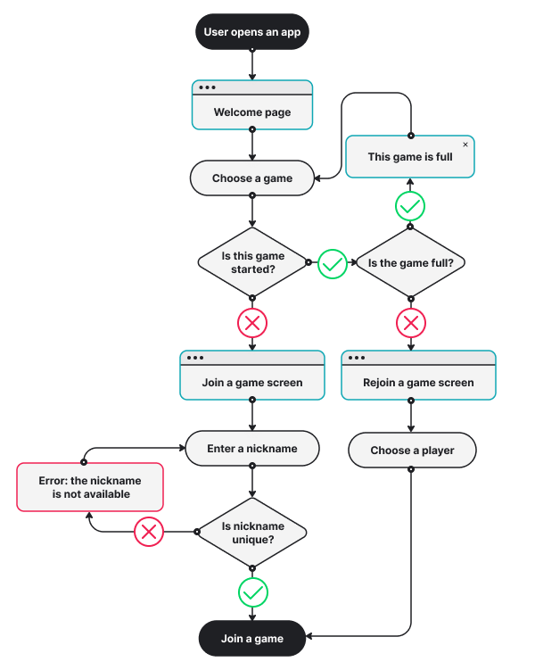    | Enter a Game         | Flow used when a player reconnects to an ongoing game after disconnecting or refreshing the application. |
| 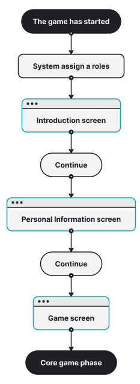  | Get a role           | Flow in which players recive a roles and related information. |
| 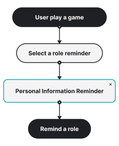| Remind Your Game Role| Individual flow enabling a player to privately review their assigned role and related knowladge during the game. |
| 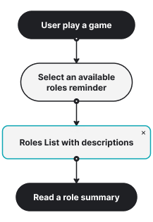     | Reminding Roles      | Individual flow enabling a player to review available roles during the game. |
| 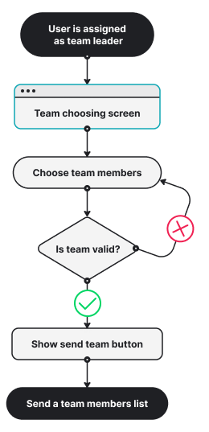      | Team Choosing        | Flow in which players are selected or assigned to a team for a mission or negotiation round. |
| 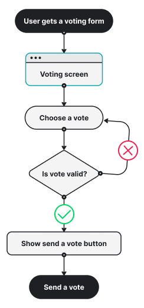               | Voting               | Flow allowing players to cast votes on decisions such as team approval, mission outcomes, or negotiations. |
| 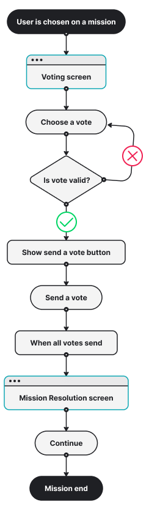       | Mission              | Flow allowing players to cast votes after being allowed to be part of a negotiations. |
| 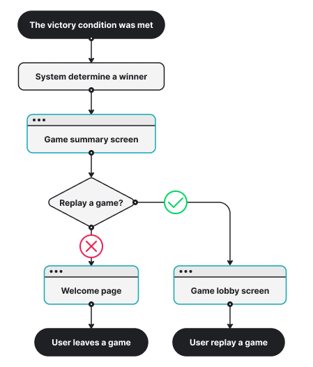  | Replay a game        | Flow describing game summary with a replay option. |

## Screen Map

The structure of navigation through the app's screens based on user flows.

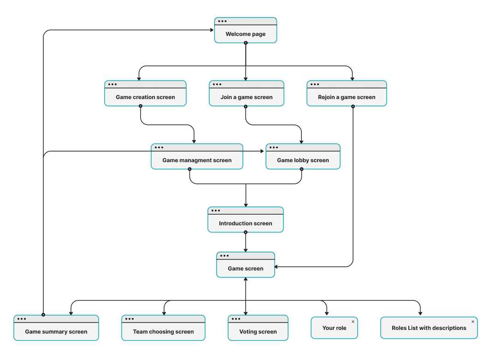

## Wireframes

Wireframe designs illustrating the layout and functionality of screens in the mobile version of the app.

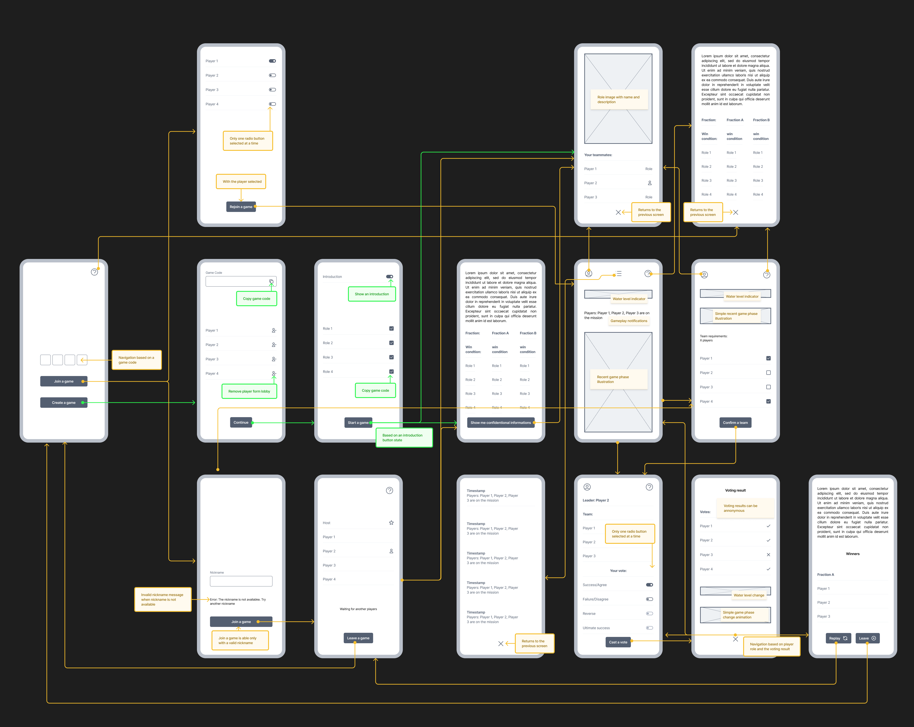

---

TODO:

# User Interface (UI) Design

## Design System

### Color Palette

Color palette was prepared for both light and dark mode. 
Used colors with key contrast values are shown below:

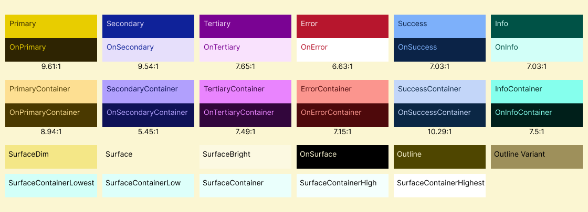
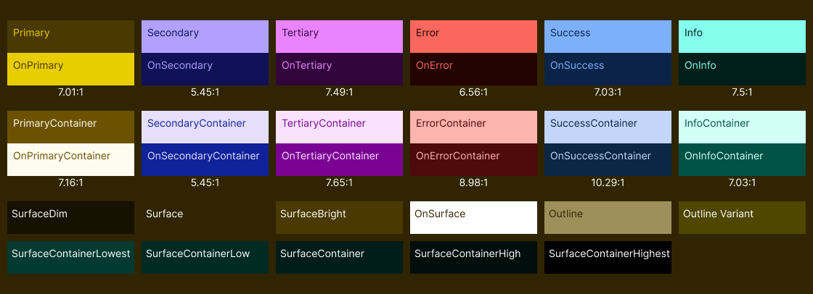

### Typography

[Font Samples Image]

## Logos and Branding

[Logo Variations Image]

## High-Fidelity Mockups

[Mockup Visualisation Image]

## Prototype

Figma Prototype: [Link to Figma Prototype](https://www.figma.com/)

Prototype user testing
