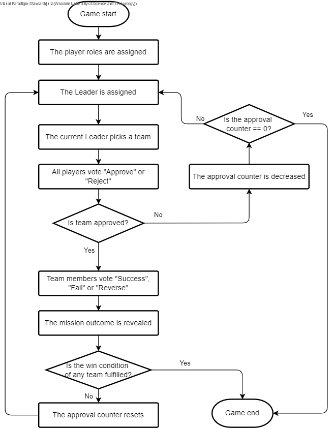

# Introduction

This document outlines the core concept of the game, including its genre, description, core loop, and target platforms.

# Description

The designed game is based on hidden identity mechanics, where players are divided into secret factions and assigned specific roles with associated privileged information. 
The core game loop follows a turn-based structure, where each turn consists of selecting a subset of players that satisfies the specific mission requirements for that round. 
Once the selection is approved, the chosen team represents the collective during the task execution, the outcome of which directly progresses the game toward the ultimate victory conditions.

The narrative follows the Convoy of the Numbian Princess as it treks across a treacherous desert to forge a vital political alliance.
However, the convoy is infiltrated by Desert Nomads—saboteurs who seek to protect their oases from foreign control by depleting the convoy’s water supplies.

## Genre & Theme

Genre: Social Deduction / Hidden Identity

The game is set in a mythical late-Antiquity era, drawing inspiration from a blend of Ancient Egyptian mysticism and nomadic Saharan cultures.

## Available Roles

The roles available in the game are divided into two main factions: 
1. The Royal Convoy: Their goal is to secure enough water to reach the alliance meeting. They must identify the infiltrators before the supplies run dry.
    - **The Numbian Princess**: A key figure whose safety is paramount. If she reaches the alliance meeting, the Convoy wins.
    - **High Priestess of Isis**: She possesses privileged information regarding the identity of the Nomads but must remain discreet to avoid targeted sabotage.
    - ***Ta-Seti* Guard**: A protective role that has informations about Priestess of Isis identity.
    - ***Chabir* Guide** (The Pathfinder): Possesses a One-Time Use (Ultimate) ability. Once per game, the Guide can lead the team to a "Hidden Oasis," guaranteeing a mission success regardless of Nomad interference.
    - **The Translator** (Good Negotiator): Can use their linguistic skills to influence the outcome of a negotiation session, potentially neutralizing a minor sabotage.
2. The Desert Nomads: Their goal is to remain hidden and ensure that three water-gathering missions fail. If the convoy runs out of water, the Nomads win and retreat to their desert strongholds.
    - **The Assassin**: A role focused on the endgame "Assassination" phase to steal victory by identifying the High Priestess.
    - **The Translator** (Evil Negotiator): Can sabotage negotiations by misleading the emissaries, changing a successful outcome into a failure.
    - **The Witch**: Appears to Guard as the High Priestess.
    - **The Lone Nomad**: Does not have information about other Nomads.
    - **The Hidden Nomad**: Appears as a Convoy member to the Priestess.

## Core Loop

1. Selection Phase: Players are assigned hidden roles and teams.
2. While winning condition not met:
	1. While team is not approved:
        1. Team Selection Phase: The team leader proposes a team for the mission that meats mission conditions.
        2. Voting Phase: All players vote to approve or reject the proposed team.
        3. Transition of Leadership: Leadership passes to the next player.
    2. Mission Phase: If the team is approved, team members secretly choose "Success", "Failure", or "Reverse" cards.
    3. Resolution Phase: The outcome of the mission is determined.
3. Endgame Phase: The roles are revealed and the winning team is announced.

# Platforms

Target platforms for the game are:
1. Android
2. Windows