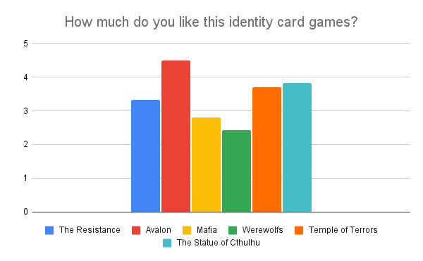
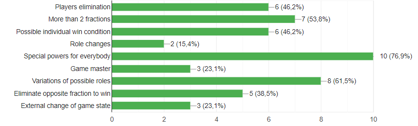
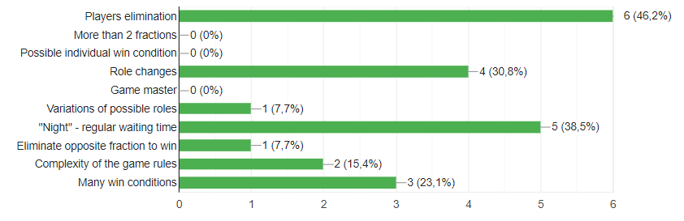
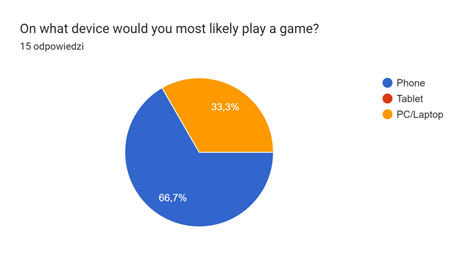
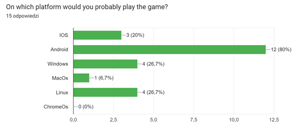
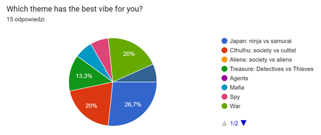
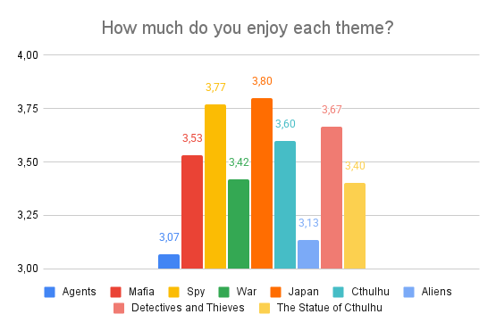

# User Survey

This document summarizes the findings from the user survey conducted to gather insights about potential users' preferences about an online version of hidden identity card game.
We collected data on players’ opinions about popular hidden-identity games, the impact of specific mechanics on the game experience, thematic preferences, and the platforms they use.

## Survey Link

User Survey was conducted through Google Forms and can be found [here](https://docs.google.com/forms/d/e/1FAIpQLSdgvIP3tgb5npGF5njSEMRlxEN7sHkjaFhnIp61Ir1vEuL9Lw/viewform?usp=header).
The intended respondents of the survey were players of card games featuring hidden identity mechanics.
## Survey Results

The survey received a total of 15 responses. Below are some key insights gathered from the survey:

1. The highest-rated games with hidden identity mechanics (with a rating above 70%) are::
	- "Avalon" (Based on "The Resistance")
	- "Pos¹¿ek Cthulhu" (literal translation: The Statue of Cthulhu)
	- "Temple of Terror" (Polish version: "Amazonki")
	- All results are shown in the chart below:

	

2. The most important mechanics that was pointed to have positive impact on the game expirience:
	- Special powers for every player (76% of respondents)
	- Variations of possible roles (61% of respondents)
	- More than two fractions (53% of respondents)
	- All results are shown in the chart below:

	

3. The most important mechanics that was pointed to have negative impact on the game expirience:
	- Players elimination (47% of respondents)
	- "Night" every round - regular waiting time (38% of respondents)
	- Role changes during the game (30% of respondents)
	- All results are shown in the chart below:

	

4. 93% of respondents would install a mobile version of a hidden identity card game.

5. Preferred devices for playing such a game are:
	- Mobile (67% of respondents)
	- PC (33% of respondents)
	- All results are shown in the chart below:

	

6. The most popular platform for playing online games is Android (80% of respondents). All results are shown in the charts below:

	

7. The most popular theme vibes were:
	- Japan (27% of respondents)
	- Cthulhu (20% of respondents)
	- War (20% of respondents)
	- All results are shown in the chart below:

	

8. All respondents also scores each theme vibe on a scale from 1 to 5. The average scores for each theme are shown in the chart below:

	

## Survey Analysis

1. Mechanics Preferences
    - Players highly value special powers and role variations, indicating a preference for dynamic gameplay.
    - Negative feedback on player elimination and waiting times suggests a desire for continuous engagement.

2. Platform Preferences
    - A significant majority are interested in mobile gaming, with Android being the most popular platform.
    - PC gaming also has a notable presence, indicating a need for cross-platform availability.
	- Android and Windows are platforms that cover the needs of 86% of surveyed users.

3. Thematic Preferences
	- Users prefer games with consistent game design and intuitive fractions goals.
	- Games with gameplay based on probability and deduction are favored.
	- Japan-themed games received the highest preference, followed by Cthulhu and war themes.

# User Personas

Based on the survey results, we have identified the following user personas:

1. Mobile Gamer
	- Profile: Primarily plays on a smartphone and enjoys social deduction games
    - Games: Prefers games similar to The Resistance than Mafia or Werewolf.
    - Gameplay Preferences: Values having a noticeable impact on the game and prefers stable player relationships, avoiding mechanics such as role changes.
	- Theme: Fictional settings with a strong, distinctive theme (like Japan or Cthulhu).

2. PC Gamer
	- Profile: Plays mainly on a PC and prioritizes gameplay over narrative.
	- Games: Enjoy playing "Temple of Terror".
	- Gameplay Preferences: Don't likes complex rules and waiting, likes diversity of fractions and roles with negative interactions (e.g. players elemination)
	- Theme: Simple modern non-fictional settings (like war or thieves).